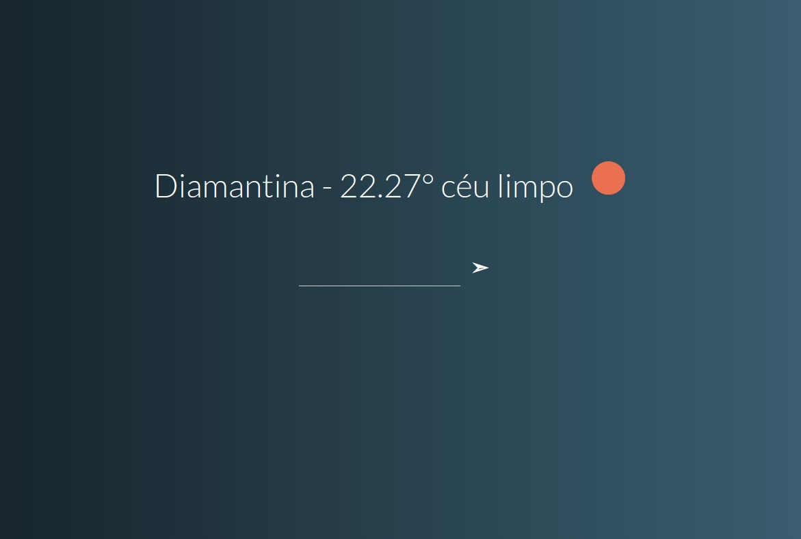
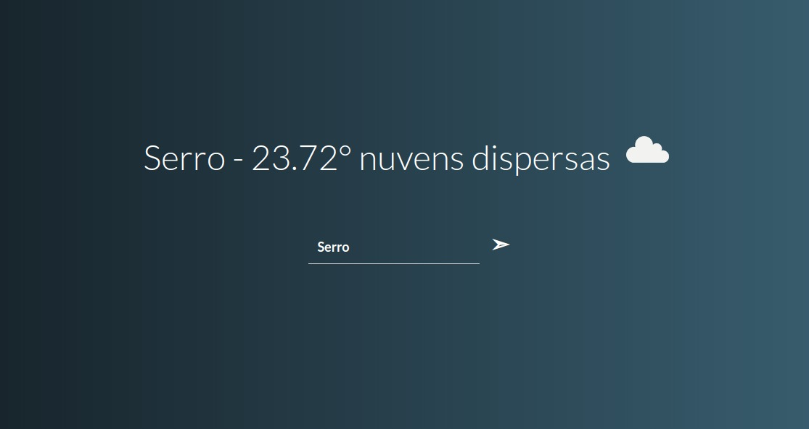
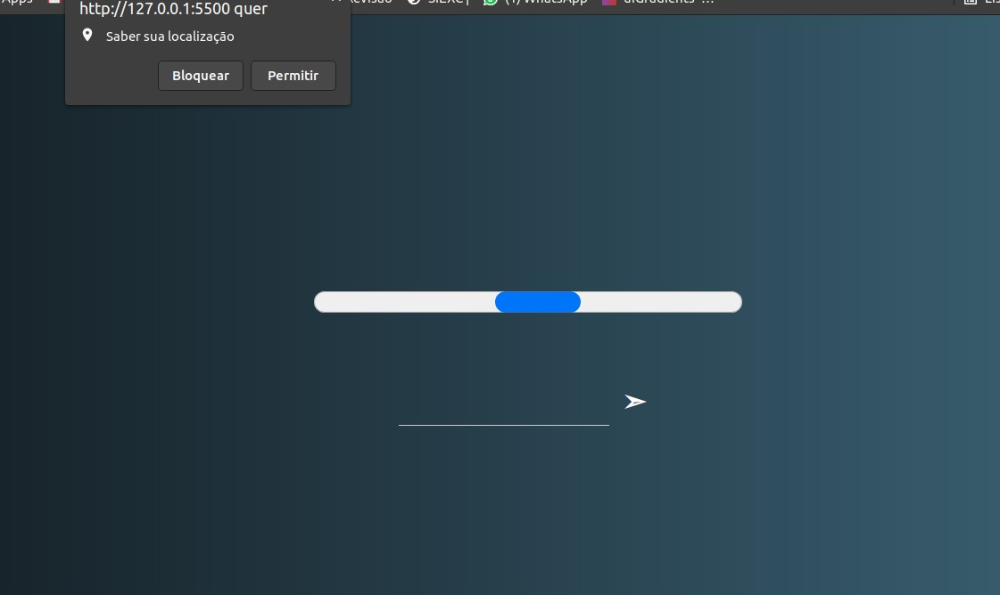

<div align="center" >
  <h1 align="center" >  
     Consultar Clima</h1> 
  
  <p>Print Aplicação</p>
 
 
 
</div>

<div>

<h1>🚀 Tecnologias</h1>
</br>
<p>Esse projeto é um estudo de Frontend usando as seguintes tecnologias:</p>
<span>
- ✔️ Javascript </br>
- ✔️ Ajax </br>
- ✔️ HTML </br>
- ✔️ CSS </br>
- ✔️ Weather API </br>
</span>
</div>

 
<div>
<h1>ℹ️ Como usar</h1>
<i>Apos clonar o repositorio </i>

```
git clone https://github.com/itals53fs/consultar-clima.git
```

<i> Crie uma conta em <a href="https://openweathermap.org/api" target="_blank"><cite>Weather API </cite> </i></a>

Faça a inscrição em <cite>Current Weather Data</cite> e substitua a key do index em ``` src/index.js ```

<i>abra o aquivo index.html em um navegador ou suba com o liveServer extensão do vsCode</i>